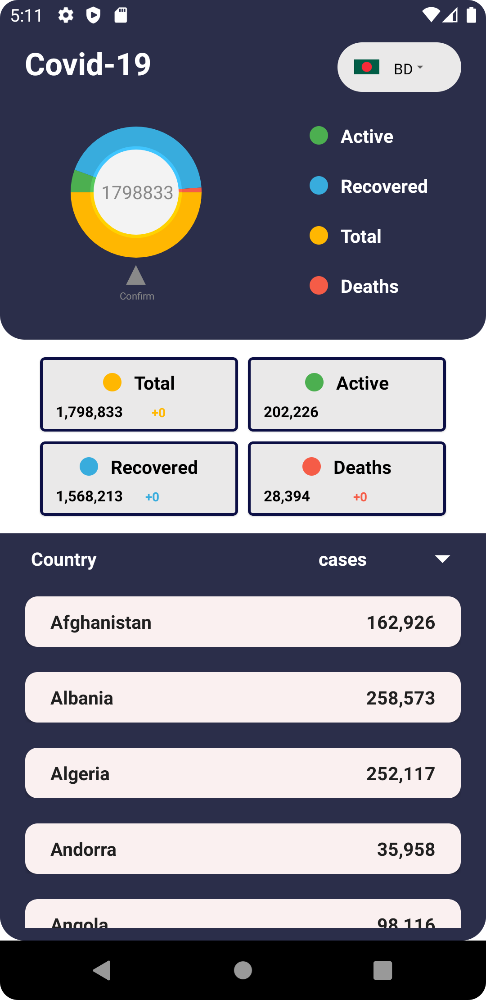
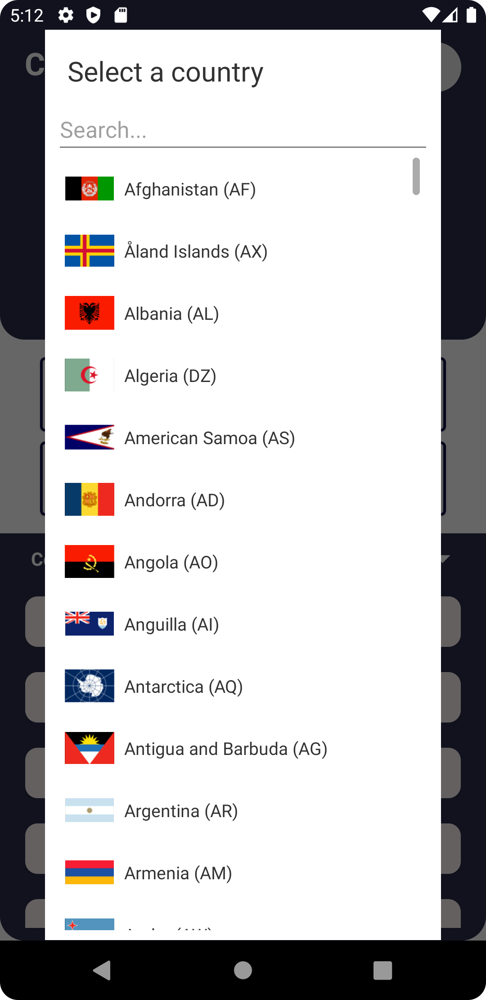
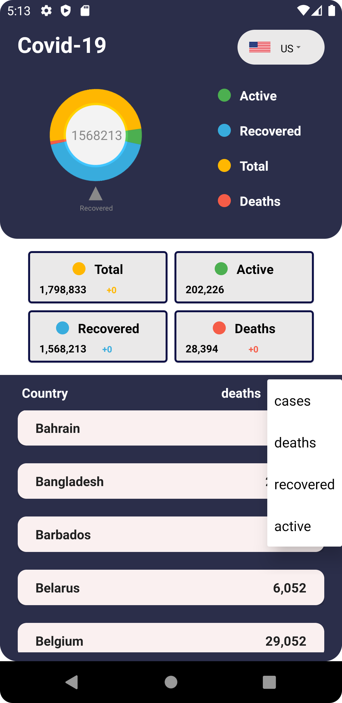

## General

COVID-19 Apps (coronavirus) cases, deaths, hospitalizations, tests • All countries • Updated daily by Our World in Data

<a id="raw-url" href="apk/Covid19.apk?raw=true">
</a>

## Screenshots

|                                       Home                 |                            Countries                           |                            Updated                          |
| :------------------------------------------------------------------: | :-----------------------------------------------------------------: | :------------------------------------------------------------------: |
|   |  |   |

## Dependencies

```
implementation 'com.squareup.retrofit2:retrofit:2.9.0'
implementation 'com.squareup.retrofit2:converter-gson:2.9.0'
implementation 'com.hbb20:ccp:2.5.1'
implementation 'com.github.blackfizz:eazegraph:1.2.2@aar'
implementation 'com.nineoldandroids:library:2.4.0'
```

